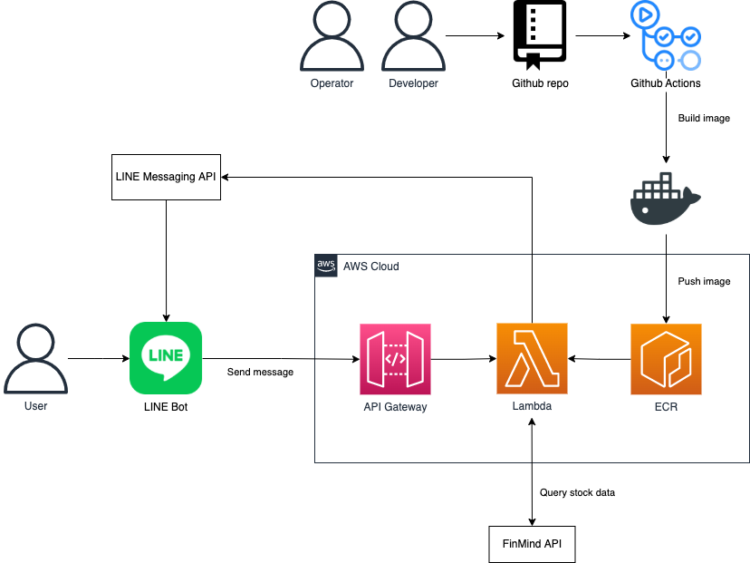

# linetwstock

A practice project to query data through [Line](https://line.me/). Data resource is from [FinMind](https://github.com/FinMind/FinMind)

## Description

The basic idea is that Line handles frontend and using AWS Lambda handles backend. In this project will output raw data which get from FinMind.

### The technical point of view and reasons for choosing

- FastAPI
  - Beautiful documentation
  - Asynchronous framework
    - Useless with AWS Lambda in this project
  - Use [Mangum](https://github.com/jordaneremieff/mangum) to adapt FastAPI with AWS Lambda and Amazon API Gateway
- AWS Lambda
  - Implementation of serverless
  - [Support deployment as container images since December 2020](https://aws.amazon.com/blogs/aws/new-for-aws-lambda-container-image-support/).
    - Reduce Docker image size by using apline base
    - Multi-stage builds in Docker
- Amazon API Gateway
  - To receive the HTPP request then excute AWS Lambda application
- AWS Systems Manager
  - To manage the FinMind/Line token of staging/production environments
- AWS CDK
  - IaC of AWS resources
    - Build docker image
    - Push docker image
    - Deploy to AWS Lambda
    - Publish HTTP endpoint with API Gateway
- CICD
  - Github Actions
  - Use OpenID Connect to access resources in AWS
  - Implementation of multistage deployments
- VSCode Remote - Containers
  - Set up a local development environment with a container image

## Demo


## Architecture



## Getting Started

### VSCode Quick Start

- Install and run extension "Remote - Containers" (id: ms-vscode-remote.remote-containers)

### Dependencies

- Python 3.9
- Poetry
- [Line Messaging API token](https://developers.line.biz/en/services/messaging-api/)
- [FinMind token](https://finmind.github.io/quickstart/)

### Set Up Development Environment

- Install Python dependencies from poetry.lock

    ```bash
    poetry install
    ```

- Set up .env file

    ```bash
    cp .env.example .env
    ```

- Docker-compose up

    ```bash
    docker-compose -f docker-compose.dev.yml up --build
    ```

- Check the response

    ```bash
    curl -vsL "http://127.0.0.1:9001/get_stock_price?stock_id=2330&start_date=2021-12-01"
    ```

### Deploy

- Set up token on AWS SSM

    ```bash
    # Staging1 secret token
    aws ssm put-parameter --name "/stg1/lambda/linetwstock/finmind_token" --value 'secret' --type "SecureString"
    aws ssm put-parameter --name "/stg1/lambda/linetwstock/line_channel_secret" --value 'secret' --type "SecureString"
    aws ssm put-parameter --name "/stg1/lambda/linetwstock/line_channel_access_token" --value 'secret' --type "SecureString"

    # Production secret token
    aws ssm put-parameter --name "/prod/lambda/linetwstock/finmind_token" --value 'secret' --type "SecureString"
    aws ssm put-parameter --name "/prod/lambda/linetwstock/line_channel_secret" --value 'secret' --type "SecureString"
    aws ssm put-parameter --name "/prod/lambda/linetwstock/line_channel_access_token" --value 'secret' --type "SecureString"
    ```

- Use CDK deploy to AWS resource from local

    ```bash
    # AWS SSO + aws-vault are recommended.
    aws-vault exec {AWS_PROFILE} -- npx cdk diff linetwstock-cdk-stack-stg1
    aws-vault exec {AWS_PROFILE} -- npx cdk deploy linetwstock-cdk-stack-stg1
    ```

### Github Actions

- Set up actions secrets `STG1_AWS_ROLE_ARN`, `PROD_AWS_ROLE_ARN`, see [here](https://docs.github.com/en/actions/security-guides/encrypted-secrets)
  - IAM Role ARN looks like ⬇️
    - `arn:aws:iam::{account_id}:role/linetwstock-stg1-github-actions`
- `workflow_dispatch` to deploy
